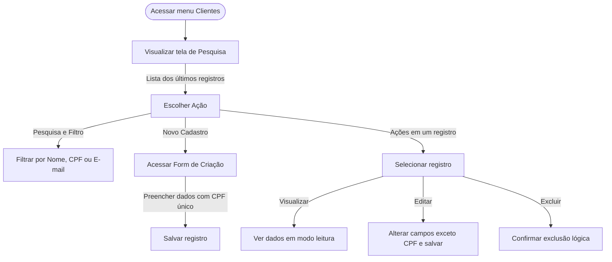

<!-- doc-template-engine: 1.0.0 | prompt: PROMPT_2A | atualizado: 2026-06-23 -->
# Feature Set: Gestão de Clientes
> **Nível 2** - Domínio: Clientes - `CLI-GES`

## Descrição
Permite gerenciar o cadastro completo dos clientes (pessoas físicas), incluindo
criação, pesquisa, visualização, edição e exclusão (lógica) dos registros.

**Não faz**: não gerencia atendimentos, pedidos ou cobranças (pertence a outros
domínios); não realiza consulta de CPF na Receita Federal (apenas validação de formato).

---

## Features

| Feature | Arquivo de Especificação (N3) | Descrição |
|---|---|---|
| **Cadastrar Cliente** <small>CLI-GES-01</small> | [f-cadastrar.md](f-cadastrar.md) | Cadastro manual de um novo cliente, exigindo CPF único. |
| **Pesquisar Clientes** <small>CLI-GES-02</small> | [f-pesquisar.md](f-pesquisar.md) | Pesquisa e filtro dos clientes por Nome, CPF ou E-mail. |
| **Visualizar Cliente** <small>CLI-GES-03</small> | [f-visualizar.md](f-visualizar.md) | Exibe os dados cadastrais completos em modo somente leitura. |
| **Editar Cliente** <small>CLI-GES-04</small> | [f-editar.md](f-editar.md) | Altera os dados de um cliente existente, com exceção do CPF (imutável). |
| **Excluir Cliente** <small>CLI-GES-05</small> | [f-excluir.md](f-excluir.md) | Exclusão lógica do cadastro de um cliente. |

---

## Fluxo Principal

---

## Dependências entre features

- **Pesquisar Clientes** é o ponto de entrada do Feature Set: é a partir dela que se acessa **Visualizar**, **Editar** e **Excluir** de um registro selecionado.
- **Cadastrar Cliente** é independente — acessada pela ação "Novo Cadastro" na tela de Pesquisa.
- **Editar**, **Visualizar** e **Excluir** exigem um cliente já cadastrado (resultado de **Cadastrar**).

---

## Telas

| Tela | Rota sugerida | Features atendidas | Descrição |
|---|---|---|---|
| **Pesquisar Clientes** | `/clientes` | **Pesquisar Clientes** <small>CLI-GES-02</small> **Excluir Cliente** <small>CLI-GES-05</small> | Filtros por Nome, CPF e E-mail; grid de resultados com ações rápidas. |
| **Manter Cliente** | `/clientes/manter` | **Cadastrar Cliente** <small>CLI-GES-01</small> **Editar Cliente** <small>CLI-GES-04</small> | Formulário de dados cadastrais; na edição o CPF fica desabilitado. |
| **Visualizar Cliente** | `/clientes/:cpf` | **Visualizar Cliente** <small>CLI-GES-03</small> | Ficha cadastral em modo somente leitura. |

---

## Permissões por perfil

> **Fonte única de permissões** deste Feature Set. As features (N3) não tratam de
> perfis nem permissões — qualquer acesso novo ou diferente entra nesta matriz.

Perfis: **Atendente**, **Supervisor**, **Auditor**.

| Perfil | Pesquisar | Cadastrar | Editar | Excluir | Visualizar |
|---|---|---|---|---|---|
| **Atendente** | ✓ | ✓ | ✓ | ✓ | ✓ |
| **Supervisor** | ✓ | ✓ | ✓ | ✓ | ✓ |
| **Auditor** | ✓ | — | — | — | ✓ |

* **Atendente** e **Supervisor** — acesso completo de manutenção.
* **Auditor** — somente leitura (pesquisar e visualizar).

---

## Changelog

| Data | Autor | Tipo | Descrição |
|---|---|---|---|
| 2026-06-23 | Exemplo | N2 criado | Gerado pelo PROMPT 2A (exemplo genérico) |

---

*Links: [N1 Clientes](../README.md) · [INDEX geral](../../INDEX.md)*
