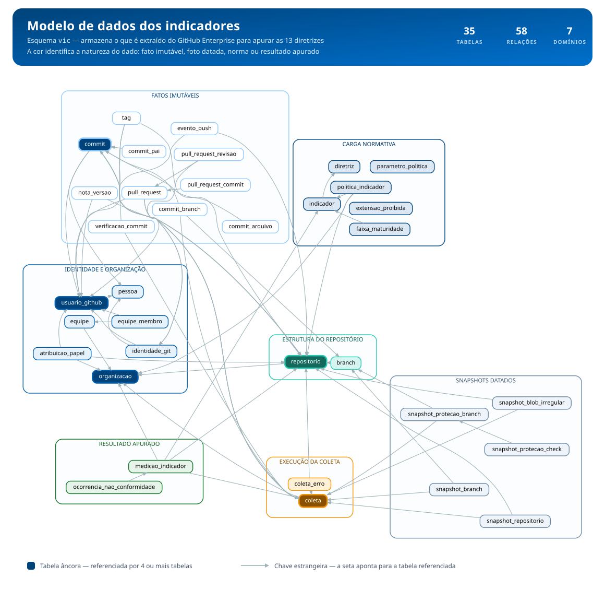
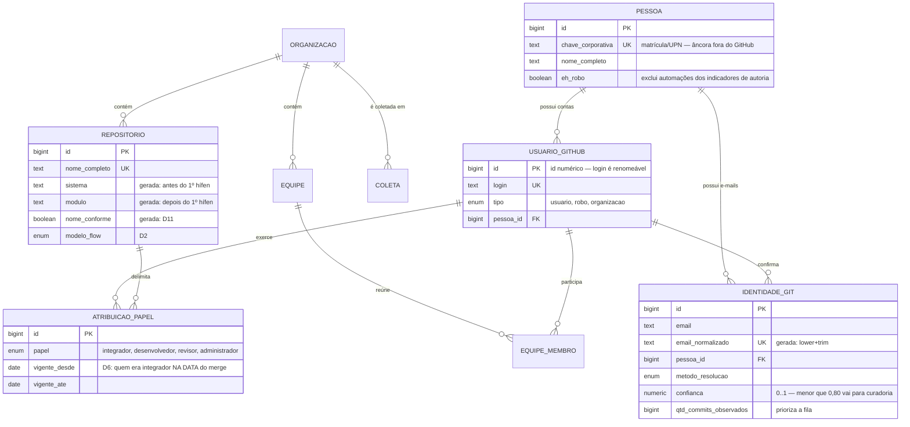
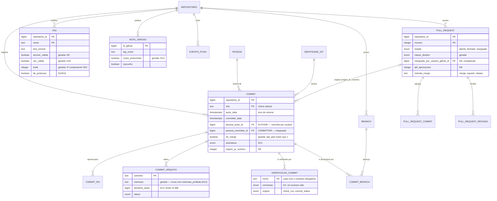
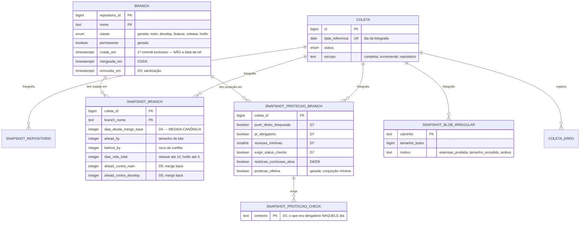
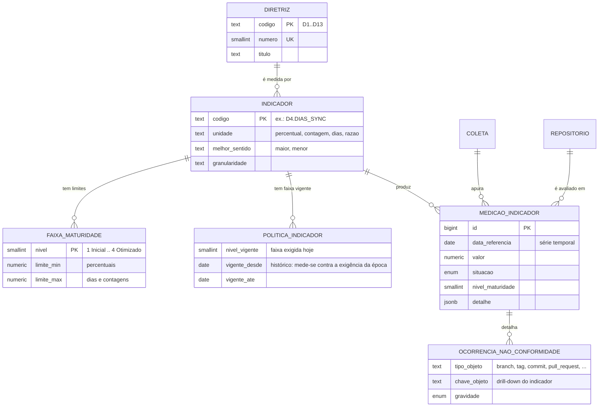

# Modelo de dados dos indicadores — VIC

Modelo relacional (PostgreSQL ≥ 14) que armazena os dados extraídos do **GitHub
Enterprise** e sustenta os indicadores das **13 Diretrizes** do Modelo VIC, exibidos
na página *Análise e Acompanhamento*.

DDL executável: [`modelo-dados.sql`](./modelo-dados.sql) — 35 tabelas, 1 visão
materializada, 4 visões, tipos enumerados, funções de classificação e carga
normativa (diretrizes, indicadores, faixas e políticas).

```
psql -v ON_ERROR_STOP=1 -f modelo-dados.sql
```

---

## 1. Decisões de projeto

### 1.1 Fato imutável × estado mutável

A maturidade é **evolução**, não retrato. O modelo separa fisicamente as duas naturezas
de dado, porque elas têm regras de gravação opostas:

| | **Fato imutável** | **Estado mutável (snapshot)** |
|---|---|---|
| Exemplos | commit, PR, revisão, tag, nota de versão, push | divergência de branch, proteção de branch, blobs irregulares |
| Chave | natural (SHA, `node_id`, `(repo, número)`) | **começa por `coleta_id`** |
| Regravação | UPSERT sobre a mesma linha, para sempre | uma linha nova por coleta |
| Pergunta que responde | "isto aconteceu" | "isto era assim no dia X" |
| Tabelas | `commit`, `pull_request`, `pull_request_revisao`, `tag`, `nota_versao`, `verificacao_commit`, `evento_push` | `snapshot_repositorio`, `snapshot_branch`, `snapshot_protecao_branch`, `snapshot_protecao_check`, `snapshot_blob_irregular` |

Um commit gravado hoje vale para sempre; regravá-lo amanhã produz exatamente a mesma
linha. Já o `behind_by` de uma branch é diferente a cada dia — e é justamente a **curva**
desses valores que mostra se o time está melhorando. Guardar só o último valor destruiria
o indicador.

Há um terceiro tipo, **entidade de vida longa**, que não é fato nem snapshot:
`vic.branch`, `vic.pessoa`, `vic.repositorio`, `vic.identidade_git`. São identidades que
existem ao longo do tempo, com marcas de primeira e última observação. A branch
`feature/x` é uma só; sua *divergência* é que muda — e por isso mora em outra tabela.

### 1.2 A coleta como eixo temporal

`vic.coleta` é a espinha dorsal: uma linha por execução do coletor, com
`data_referencia` (o dia a que a fotografia se refere). Todo snapshot referencia
`coleta_id` na primeira posição da chave primária. Consequências diretas:

- reprocessar a coleta de ontem **sobrescreve** aquele dia, não duplica;
- a série temporal é `GROUP BY data_referencia` sem nenhum artifício;
- `vic.coleta_erro` registra falhas por recurso — sem isso, um indicador que cai por
  timeout de API é lido como piora de conformidade.

### 1.3 Identidade de autor

No Git, o autor é um par **nome/e-mail arbitrário**, escrito na máquina do
desenvolvedor. Não é o login do GitHub, ninguém valida, e o mesmo humano aparece com
vários e-mails (corporativo, pessoal, `noreply` do GitHub, o que o `git config` da VM
tinha por padrão). Sem resolver isso, "commits por usuário" é ficção.

O modelo usa **três níveis**:

```
vic.identidade_git   (e-mail do Git)      ──┐
                                            ├──►  vic.pessoa   (o humano)
vic.usuario_github   (login do GitHub)    ──┘
```

- `vic.pessoa` — o humano canônico, ancorado na `chave_corporativa` (matrícula/UPN).
  É a única âncora estável fora do GitHub.
- `vic.identidade_git` — um registro por e-mail normalizado (`lower` + `trim`, coluna
  gerada e única). Guarda `metodo_resolucao`, `confianca` (0–1) e
  `qtd_commits_observados`.
- `vic.usuario_github` — a conta. Um humano pode ter mais de uma; por isso o vínculo é
  N:1 com `pessoa`, não identidade.

**Estratégia de resolução**, em ordem de precedência decrescente (cada passo só age
sobre o que sobrou):

| # | Método | Sinal | Confiança |
|---|---|---|---|
| 1 | `api_github` | a própria API associou o commit a uma conta (`commit.author.login`) | 1,00 |
| 2 | `noreply_github` | e-mail `12345+login@users.noreply.github.com` → extrai o login | 0,95 |
| 3 | `diretorio_corporativo` | e-mail bate com `pessoa.email_corporativo` (LDAP/AD/Entra) | 1,00 |
| 4 | `email_identico` | mesmo e-mail já resolvido em outro repositório | herda |
| 5 | `heuristica_nome` | mesmo nome normalizado, mesma organização | 0,60 — **exige curadoria** |
| 6 | `curadoria_manual` | vínculo confirmado por pessoa | 1,00 |

O que sobra fica com `pessoa_id IS NULL` e aparece em
`vic.vw_identidade_pendente_curadoria`, **ordenado por volume de commits**: resolve-se
primeiro o e-mail que mais distorce o indicador. Enquanto essa fila tiver e-mails
relevantes, o volume por usuário está subestimado — e a consulta 5.4 mede exatamente
essa cobertura, para que o número nunca seja apresentado como se fosse completo.

Robôs não são exceção mal resolvida: `pessoa.eh_robo` e
`usuario_github.tipo = 'robo'` os separam explicitamente, e as consultas de autoria os
excluem.

### 1.4 `author` × `committer`: qual conta para "commits por usuário"

Todo commit tem os dois, e eles divergem sempre que o histórico é reescrito:

| Operação | `author` | `committer` |
|---|---|---|
| commit normal | quem escreveu | o mesmo |
| `rebase` | **preservado** | quem rebaseou |
| `cherry-pick` | **preservado** | quem aplicou |
| merge pela interface do GitHub | quem escreveu | `web-flow` (robô do GitHub) |
| `squash` na conclusão do PR | autor do primeiro commit / autor do PR | `web-flow` |

**Decisão: o volume de commits por usuário usa `author`** (`vic.commit.pessoa_autor_id`).
Justificativa: o author registra a autoria intelectual da mudança e sobrevive a rebase,
cherry-pick e squash. Contar por committer atribuiria a um integrador — ou ao robô
`web-flow` — todo o trabalho de um time que faz rebase antes de integrar, que é
exatamente o comportamento que as Diretrizes 3 e 4 incentivam. O indicador puniria a
boa prática.

O committer não é descartado: `pessoa_committer_id` fica gravado e é a coluna correta
para métricas de **integração e operação** (quem aplicou, quem reescreveu histórico),
complementando a D6, cuja fonte primária é `pull_request.mergeado_por_usuario_github_id`.

Duas regras acompanham a decisão, ambas materializadas no esquema:

- **Merges não contam como autoria.** `vic.commit.eh_merge` é coluna gerada
  (`qtd_pais > 1`); um merge não representa trabalho escrito. As consultas filtram
  `NOT eh_merge`, e o agregado `mv_commit_dia` separa `qtd_commits` de `qtd_merges`.
- **O eixo do tempo é `autor_data`**, não `committer_data`. Um rebase de hoje sobre
  código escrito no mês passado não deve mover o volume do mês passado para este mês.

### 1.5 Idempotência da carga

A coleta roda repetidamente e nunca deve duplicar. Toda tabela tem chave natural:

| Tabela | Chave de conflito |
|---|---|
| `commit` | `(repositorio_id, sha)` |
| `pull_request` | `(repositorio_id, numero)` — mais `node_id` e `id_github` únicos |
| `pull_request_revisao` | `id_github` |
| `tag` | `(repositorio_id, nome)` |
| `nota_versao` | `(repositorio_id, id_github)` |
| `identidade_git` | `email_normalizado` (coluna gerada) |
| `repositorio` / `usuario_github` / `equipe` | `id` numérico do GitHub |
| `evento_push` | `chave_evento` (id do audit log / `X-GitHub-Delivery`) |
| snapshots | `(coleta_id, …)` |

Ids numéricos e `node_id` são preferidos ao `login`/`nome`, que são renomeáveis. Ver os
UPSERTs concretos na seção 4.

### 1.6 Granularidade: nada é guardado só agregado

`vic.medicao_indicador` guarda o **resultado** de cada indicador por repositório e por
data — mas é derivado, nunca fonte. Todo valor ali é reconstruível a partir dos fatos e
snapshots, o que permite duas coisas que um data mart agregado não permite:

1. **recortar de um jeito novo** (por sistema, por pessoa, por classe de branch) sem
   recoletar nada;
2. **recalcular o histórico** quando uma regra muda — por exemplo, quando a governança
   avança a faixa vigente da D4.

`vic.ocorrencia_nao_conformidade` fecha o ciclo: cada medição aponta *quais* branches,
tags ou commits reprovaram. Indicador sem drill-down é número sem plano de ação.

### 1.7 Regras de conformidade textual dentro do banco

SemVer, VEC, `SISTEMA-modulo` e o padrão de nome de branch são **funções `IMMUTABLE`**
(`vic.eh_semver`, `vic.eh_vec`, `vic.repo_nome_conforme`, `vic.branch_nome_conforme`,
`vic.classificar_branch`) usadas em **colunas geradas**. A classificação é calculada
na gravação, pelo banco:

- não há como a carga histórica e a carga nova divergirem de critério;
- alterar a regra é `CREATE OR REPLACE FUNCTION` + `UPDATE` de rematerialização, não
  uma varredura de código do coletor;
- `tag.semver_valida`, `tag.vec_valida`, `tag.major/minor/patch/build`,
  `branch.classe`, `branch.permanente`, `repositorio.sistema/modulo` e
  `nota_versao.corpo_preenchido` saem prontos para consulta.

---

## 2. Diagramas

### 2.0 Visão geral do esquema



O diagrama é gerado a partir do catálogo do próprio PostgreSQL depois de aplicar
o `modelo-dados.sql`, e não transcrito à mão — as 35 tabelas e as 58 chaves
estrangeiras são as que existem de fato no DDL.

A cor identifica a **natureza do dado**, que é a decisão central do modelo:
fato imutável, foto datada, carga normativa ou resultado apurado. As caixas
escuras são as tabelas âncora, referenciadas por quatro ou mais tabelas —
`repositorio`, `coleta`, `usuario_github`, `organizacao` e `commit`. Os
diagramas das seções seguintes detalham cada domínio.

### 2.1 Identidade e catálogo



### 2.2 Fatos imutáveis



### 2.3 Estados mutáveis — snapshots datados



### 2.4 Indicadores e política de maturidade



---

## 3. As tabelas

### 3.1 Catálogo e identidade

| Tabela | Para que serve |
|---|---|
| `vic.organizacao` | Organização do GitHub Enterprise. Escopo máximo de consolidação. PK = id numérico do GitHub. |
| `vic.repositorio` | Repositório. Unidade de recorte de quase todo indicador. Colunas geradas `sistema`, `modulo` e `nome_conforme` resolvem a D11 na gravação. `em_escopo_vic` exclui sandbox e forks externos da apuração. |
| `vic.pessoa` | O humano canônico. Alvo final de "commits por usuário". Ancorado em `chave_corporativa`. |
| `vic.identidade_git` | Um registro por e-mail de autoria do Git. É a ponte e-mail → pessoa, com método e confiança da resolução. |
| `vic.usuario_github` | A conta do GitHub (login). N:1 com `pessoa`. |
| `vic.equipe` / `vic.equipe_membro` | Times do GitHub, com vínculo **temporal** (`vigente_desde`/`vigente_ate`). `eh_grupo_integradores` marca a fonte do papel da D6. |
| `vic.atribuicao_papel` | Quem exerce cada papel VIC, em que escopo (repositório ou organização) e em que período. Historiado porque a D6 pergunta quem era integrador **na data do merge**, não hoje. |

### 3.2 Coleta

| Tabela | Para que serve |
|---|---|
| `vic.coleta` | Uma linha por execução do coletor. Eixo temporal de todos os snapshots e fronteira de idempotência: `UNIQUE (organizacao_id, data_referencia, escopo)`. |
| `vic.coleta_erro` | Falhas por recurso (repositório, endpoint, HTTP status). Distingue "não conforme" de "não coletado". |

### 3.3 Fatos imutáveis

| Tabela | Para que serve |
|---|---|
| **`vic.commit`** | **Entidade de primeira classe.** Um registro por commit por repositório, PK `(repositorio_id, sha)`. Guarda os pares nome/e-mail de author *e* committer em bruto, mais as quatro resoluções (`identidade_*`, `usuario_github_*`, `pessoa_*`). É o fato que responde "quantos" e "quais" commits, por pessoa, repositório e período. |
| `vic.commit_pai` | Arestas do DAG, com `ordem`. Permite caminhar por *first-parent* e identificar o lado integrado de um merge. |
| `vic.commit_arquivo` | Arquivos tocados por commit, com `extensao` (gerada) e `tamanho_bytes`. Registra a violação **histórica** da D12 — o `.zip` que entrou e depois saiu. |
| `vic.commit_branch` | Alcançabilidade observada commit ↔ branch. Associação de vida longa (primeira/última observação), não snapshot: regravar a lista inteira a cada coleta multiplicaria o histórico sem ganho analítico. |
| `vic.pull_request` | PR com origem, destino (classes geradas), autor, **quem concluiu o merge** (D6), método de merge e contagem de aprovações. |
| `vic.pull_request_commit` | Commits que compunham o PR. Base para resolver `commit.origem_pr_numero` (D8). |
| `vic.pull_request_revisao` | Cada evento de revisão. Uma aprovação depois descartada continua registrada — o descarte é outro evento. |
| `vic.verificacao_commit` | Check runs e commit statuses por commit (D1). A lista do que é *obrigatório* não está aqui: vem de `snapshot_protecao_check`, porque a exigência muda com o tempo. |
| `vic.tag` | Tags com conformidade SemVer/VEC e componentes `major/minor/patch/build` calculados pelo banco (D9, D10, D11). `de_producao` marca a versão promovida. |
| `vic.nota_versao` | Release do GitHub. `corpo_preenchido` (gerada) é o indicador direto da D13. |
| `vic.evento_push` | Pushes do audit log/webhook. Evidência direta de push direto e force-push em branch permanente — o que a proteção deveria impedir (D7/D12). |

### 3.4 Estados mutáveis — snapshots

| Tabela | Para que serve |
|---|---|
| `vic.snapshot_repositorio` | Fotografia do repositório: presença e proteção de `main`/`develop` (D2), contagem de branches obsoletas e idade da mais antiga (D3), totais de tags, releases e blobs irregulares. |
| **`vic.snapshot_branch`** | O estado mutável por excelência. `dias_desde_merge_base` (medida canônica da D4), `ahead_by`, `behind_by`, `dias_vida_total`, e `ahead_contra_main`/`ahead_contra_develop` para o merge back da D5. Uma linha por branch por coleta. |
| `vic.snapshot_protecao_branch` | Regras de proteção vigentes na data (D7), com `protecao_efetiva` gerada pela conjunção mínima: protegida + push direto bloqueado + PR obrigatório + ≥ 1 revisão + status checks obrigatórios. |
| `vic.snapshot_protecao_check` | Os contextos de status check **obrigatórios naquele dia**. Uma tag de março deve ser avaliada contra a exigência de março, não contra a de hoje (D1). |
| `vic.snapshot_blob_irregular` | Arquivos da árvore que violam formato ou tamanho na data (D12). Só as violações são gravadas — a árvore inteira seria volume sem uso analítico. |

Por que `snapshot_branch` guarda `dias_desde_merge_base` calculado na carga em vez de
coluna gerada: a conversão de `timestamptz` para dia depende do fuso horário da sessão,
o que não é `IMMUTABLE` e o PostgreSQL não aceita em coluna gerada. O fuso institucional
está em `vic.parametro_politica` (`vic.fuso_horario`).

### 3.5 Indicadores e política

| Tabela | Para que serve |
|---|---|
| `vic.diretriz` | As 13 diretrizes, com link para a página do modelo. Carregada pelo próprio DDL. |
| `vic.indicador` | Catálogo dos 21 indicadores. Uma diretriz pode ter mais de um — a D4 tem três dimensões independentes (`D4.DIAS_SYNC`, `D4.AHEAD`, `D4.VIDA_TOTAL`), porque a própria diretriz determina limites próprios para cada uma. |
| `vic.faixa_maturidade` | Faixas 1 Inicial → 4 Otimizado. Para percentuais usa `limite_min`; para dias e contagens, `limite_max`. As faixas da D4 são a transcrição literal da tabela normativa da Diretriz 4. |
| `vic.politica_indicador` | Faixa **vigente** por escopo e período. O DDL carrega a faixa 1 como linha de base, com a observação da regra da D4: coletar 60 dias sem limiar, fixar no P75 observado e avançar uma faixa por trimestre até a faixa 3. |
| `vic.extensao_proibida` | Lista normativa da D12 (`zip`, `rar`, `jar`, `ear`, `jpg`, `bmp`, `pdf`, `docx`, `xlsx`…). Tabela, não constante no coletor: revisável pela governança sem alterar código. |
| `vic.parametro_politica` | Parâmetros numéricos (limite de 10 MB, vida máxima de release/hotfix, aprovações mínimas, fuso). |
| `vic.medicao_indicador` | Série temporal dos resultados, por indicador, repositório e data. `repositorio_id` nulo = consolidado da organização. `detalhe` (JSONB) guarda percentis e limites aplicados sem exigir coluna nova por indicador. |
| `vic.ocorrencia_nao_conformidade` | Evidência granular: qual branch, tag, commit ou PR reprovou. Drill-down obrigatório de cada medição. |

### 3.6 Visões

| Objeto | Para que serve |
|---|---|
| `vic.vw_commit_autoria` | Commit já resolvido a pessoa e repositório. Ponto de entrada padrão das consultas de autoria. |
| `vic.vw_identidade_pendente_curadoria` | Fila de curadoria de identidade, ordenada por impacto. |
| `vic.vw_ultima_coleta` | Coleta válida mais recente por organização — base dos painéis "hoje". |
| `vic.vw_auditoria_referencia_orfa` | Referências apontando para objetos ausentes (efeito esperado da janela de coleta incremental). |
| `vic.mv_commit_dia` (materializada) | Volume diário por repositório e pessoa. **Cache, não fonte** — `vic.commit` continua sendo o fato. `REFRESH MATERIALIZED VIEW CONCURRENTLY vic.mv_commit_dia;` ao fim de cada coleta. |

### 3.7 Três vínculos sem `FOREIGN KEY` — de propósito

`commit_pai.sha_pai`, `pull_request_commit.sha` e `commit.origem_pr_numero` não têm FK,
sempre pelo mesmo motivo: a **janela de coleta**. O objeto referenciado pode ser legítimo
e simplesmente estar fora do recorte carregado — o pai além do histórico coletado, o
commit original que o squash tornou inalcançável, o PR antigo numa carga incremental. Uma
FK transformaria isso em erro de carga. Há índice para o join, e
`vic.vw_auditoria_referencia_orfa` mede o resíduo: esperado > 0 em carga incremental,
deve ser 0 após coleta completa.

---

## 4. Carga idempotente

### 4.1 Fato — UPSERT que preserva a primeira observação

```sql
INSERT INTO vic.commit AS c (
    repositorio_id, sha, node_id, mensagem,
    autor_nome, autor_email, autor_data,
    committer_nome, committer_email, committer_data,
    qtd_pais, arvore_sha, assinatura,
    adicoes, delecoes, arquivos_alterados,
    coleta_primeira_id, coleta_ultima_id
) VALUES (
    $1, $2, $3, $4,
    $5, $6, $7,
    $8, $9, $10,
    $11, $12, $13,
    $14, $15, $16,
    $17, $17
)
ON CONFLICT (repositorio_id, sha) DO UPDATE
   SET coleta_ultima_id    = EXCLUDED.coleta_ultima_id,
       adicoes             = COALESCE(EXCLUDED.adicoes, c.adicoes),
       delecoes            = COALESCE(EXCLUDED.delecoes, c.delecoes),
       arquivos_alterados  = COALESCE(EXCLUDED.arquivos_alterados, c.arquivos_alterados),
       assinatura          = EXCLUDED.assinatura;
```

`coleta_primeira_id` nunca é reescrita — permite auditar a latência entre o commit e a
coleta. Colunas geradas (`assunto`, `eh_merge`) não aparecem no INSERT: o banco as
calcula.

### 4.2 Snapshot — uma linha por coleta

```sql
INSERT INTO vic.snapshot_branch (
    coleta_id, repositorio_id, branch_nome, data_referencia, existe,
    sha_head, branch_base, sha_merge_base, data_merge_base,
    dias_desde_merge_base, ahead_by, behind_by,
    data_primeiro_commit, dias_vida_total, mergeada,
    ahead_contra_main, ahead_contra_develop
) VALUES (
    $1, $2, $3, $4, TRUE,
    $5, $6, $7, $8,
    $9, $10, $11,
    $12, $13, $14,
    $15, $16
)
ON CONFLICT (coleta_id, repositorio_id, branch_nome) DO UPDATE
   SET sha_head              = EXCLUDED.sha_head,
       dias_desde_merge_base = EXCLUDED.dias_desde_merge_base,
       ahead_by              = EXCLUDED.ahead_by,
       behind_by             = EXCLUDED.behind_by,
       dias_vida_total       = EXCLUDED.dias_vida_total,
       ahead_contra_main     = EXCLUDED.ahead_contra_main,
       ahead_contra_develop  = EXCLUDED.ahead_contra_develop;
```

Rodar a coleta duas vezes no mesmo dia corrige a linha do dia. Rodar amanhã cria a
próxima. A série se forma sozinha.

### 4.3 Identidade — acumula observação sem perder curadoria

```sql
INSERT INTO vic.identidade_git AS ig (
    email, nome_observado, primeira_ocorrencia_em, ultima_ocorrencia_em, qtd_commits_observados
) VALUES ($1, $2, $3, $3, 1)
ON CONFLICT (email_normalizado) DO UPDATE
   SET nome_observado         = EXCLUDED.nome_observado,
       primeira_ocorrencia_em = LEAST(ig.primeira_ocorrencia_em, EXCLUDED.primeira_ocorrencia_em),
       ultima_ocorrencia_em   = GREATEST(ig.ultima_ocorrencia_em, EXCLUDED.ultima_ocorrencia_em),
       qtd_commits_observados = ig.qtd_commits_observados + 1;
```

O UPDATE nunca toca `pessoa_id`, `metodo_resolucao` nem `confianca`: a curadoria manual
é preservada entre coletas.

### 4.4 Pipeline de resolução de identidade

```sql
-- Passo 1 — e-mail noreply do GitHub carrega o login dentro de si.
UPDATE vic.identidade_git ig
   SET usuario_github_id = ug.id,
       pessoa_id         = ug.pessoa_id,
       metodo_resolucao  = 'noreply_github',
       confianca         = 0.95,
       revisada_em       = now()
  FROM vic.usuario_github ug
 WHERE ig.pessoa_id IS NULL
   AND ig.email_normalizado ~ '^([0-9]+\+)?[a-z0-9-]+@users\.noreply\.github\.com$'
   AND ug.login = substring(ig.email_normalizado from '^(?:[0-9]+\+)?([a-z0-9-]+)@users\.noreply\.github\.com$');

-- Passo 2 — e-mail bate com o diretório corporativo.
UPDATE vic.identidade_git ig
   SET pessoa_id        = p.id,
       metodo_resolucao = 'diretorio_corporativo',
       confianca        = 1.00,
       revisada_em      = now()
  FROM vic.pessoa p
 WHERE ig.pessoa_id IS NULL
   AND lower(p.email_corporativo) = ig.email_normalizado;

-- Passo 3 — propaga a resolução para os commits (author e committer).
UPDATE vic.commit c
   SET identidade_autor_id = ig.id,
       pessoa_autor_id     = ig.pessoa_id
  FROM vic.identidade_git ig
 WHERE ig.email_normalizado = lower(btrim(c.autor_email))
   AND (c.identidade_autor_id IS DISTINCT FROM ig.id
        OR c.pessoa_autor_id IS DISTINCT FROM ig.pessoa_id);

UPDATE vic.commit c
   SET identidade_committer_id = ig.id,
       pessoa_committer_id     = ig.pessoa_id
  FROM vic.identidade_git ig
 WHERE ig.email_normalizado = lower(btrim(c.committer_email))
   AND (c.identidade_committer_id IS DISTINCT FROM ig.id
        OR c.pessoa_committer_id IS DISTINCT FROM ig.pessoa_id);
```

Ao fim: `REFRESH MATERIALIZED VIEW CONCURRENTLY vic.mv_commit_dia;`

---

## 5. Consultas de exemplo

### 5.1 Volume de commits por repositório num período

```sql
SELECT r.nome_completo                                        AS repositorio,
       r.sistema,
       count(*) FILTER (WHERE NOT c.eh_merge)                 AS commits,
       count(*) FILTER (WHERE c.eh_merge)                     AS merges,
       count(DISTINCT c.pessoa_autor_id)                      AS autores_distintos,
       sum(c.adicoes) FILTER (WHERE NOT c.eh_merge)           AS linhas_adicionadas,
       sum(c.delecoes) FILTER (WHERE NOT c.eh_merge)          AS linhas_removidas,
       min(c.autor_data)                                      AS primeiro_commit,
       max(c.autor_data)                                      AS ultimo_commit
  FROM vic.commit c
  JOIN vic.repositorio r ON r.id = c.repositorio_id
 WHERE c.autor_data >= DATE '2026-07-01'
   AND c.autor_data <  DATE '2026-08-01'
   AND r.em_escopo_vic
 GROUP BY r.nome_completo, r.sistema
 ORDER BY commits DESC;
```

Série mensal, pelo agregado de conveniência:

```sql
SELECT date_trunc('month', d.dia)::DATE AS mes,
       r.nome_completo                  AS repositorio,
       sum(d.qtd_commits)               AS commits
  FROM vic.mv_commit_dia d
  JOIN vic.repositorio r ON r.id = d.repositorio_id
 WHERE d.dia >= DATE '2026-01-01'
 GROUP BY 1, 2
 ORDER BY 1, 3 DESC;
```

### 5.2 Commits por usuário — volume

Totais por pessoa e por pessoa×repositório na mesma passada (`GROUPING SETS`).
Conta o **author**, exclui merges e robôs:

```sql
SELECT p.nome_completo                                            AS pessoa,
       r.nome_completo                                            AS repositorio,
       count(*)                                                   AS commits,
       count(DISTINCT c.repositorio_id)                           AS repositorios,
       count(*) FILTER (WHERE c.assinatura = 'verificada')        AS commits_assinados,
       count(*) FILTER (WHERE c.origem_pr_numero IS NOT NULL)     AS commits_via_pr,
       round(100.0 * count(*) FILTER (WHERE c.assinatura = 'verificada')
             / count(*), 1)                                       AS pct_assinados
  FROM vic.commit c
  JOIN vic.pessoa p      ON p.id = c.pessoa_autor_id
  JOIN vic.repositorio r ON r.id = c.repositorio_id
 WHERE c.autor_data >= now() - INTERVAL '90 days'
   AND NOT c.eh_merge
   AND NOT p.eh_robo
 GROUP BY GROUPING SETS ((p.nome_completo, r.nome_completo), (p.nome_completo))
 ORDER BY p.nome_completo, commits DESC;
```

### 5.3 Quais commits — listagem de uma pessoa num repositório

```sql
SELECT v.repositorio,
       v.sha_curto,
       v.autor_data,
       v.assunto,
       v.adicoes,
       v.delecoes,
       v.origem_pr_numero,
       v.assinatura
  FROM vic.vw_commit_autoria v
 WHERE v.pessoa_id = (SELECT id FROM vic.pessoa WHERE chave_corporativa = 'c123456')
   AND v.repositorio = 'CAIXA/SIGES-cadastro'
   AND v.autor_data >= DATE '2026-07-01'
   AND v.autor_data <  DATE '2026-08-01'
   AND NOT v.eh_merge
 ORDER BY v.autor_data DESC;
```

### 5.4 Cobertura da resolução de identidade (honestidade do indicador)

```sql
SELECT count(*)                                                   AS commits,
       count(*) FILTER (WHERE pessoa_autor_id IS NOT NULL)        AS com_autoria_resolvida,
       round(100.0 * count(*) FILTER (WHERE pessoa_autor_id IS NOT NULL)
             / nullif(count(*), 0), 1)                            AS pct_resolvido,
       count(DISTINCT autor_email) FILTER (WHERE pessoa_autor_id IS NULL) AS emails_pendentes
  FROM vic.commit
 WHERE autor_data >= now() - INTERVAL '90 days';
```

Abaixo de ~95 % de resolução, o ranking por pessoa da consulta 5.2 deve ser apresentado
com a ressalva — e `vic.vw_identidade_pendente_curadoria` lista o que resolver primeiro.

---

### 5.5 Indicador D1 — Validação de produção

Tags de produção cujo commit teve **todos** os checks obrigatórios com sucesso. Os
contextos obrigatórios vêm do snapshot da proteção, não de uma lista fixa:

```sql
WITH col AS (
    SELECT id AS coleta_id
      FROM vic.vw_ultima_coleta
     WHERE organizacao_id = 1
),
obrigatorios AS (
    SELECT spc.repositorio_id, spc.contexto
      FROM vic.snapshot_protecao_check spc
      JOIN col ON col.coleta_id = spc.coleta_id
      JOIN vic.branch b ON b.repositorio_id = spc.repositorio_id
                       AND b.nome = spc.branch_nome
     WHERE b.classe = 'main'
),
avaliacao AS (
    SELECT t.repositorio_id,
           t.nome                                              AS tag,
           count(o.contexto)                                   AS checks_exigidos,
           count(*) FILTER (WHERE vc.conclusao = 'sucesso')     AS checks_aprovados
      FROM vic.tag t
      JOIN obrigatorios o ON o.repositorio_id = t.repositorio_id
      LEFT JOIN vic.verificacao_commit vc
             ON vc.repositorio_id = t.repositorio_id
            AND vc.sha            = t.sha_commit
            AND vc.nome           = o.contexto
     WHERE t.de_producao
       AND t.tagueada_em >= DATE '2026-01-01'
     GROUP BY t.repositorio_id, t.nome
)
SELECT r.nome_completo                                                       AS repositorio,
       count(*)                                                              AS tags_producao,
       count(*) FILTER (WHERE a.checks_aprovados = a.checks_exigidos)        AS validadas,
       round(100.0 * count(*) FILTER (WHERE a.checks_aprovados = a.checks_exigidos)
             / count(*), 1)                                                  AS pct_d1
  FROM avaliacao a
  JOIN vic.repositorio r ON r.id = a.repositorio_id
 GROUP BY r.nome_completo
 ORDER BY pct_d1;
```

### 5.6 Indicador D3 — Sanitização de branches

Branches temporárias mergeadas e **não** deletadas, com a idade da mais antiga:

```sql
SELECT r.nome_completo                                                          AS repositorio,
       count(*) FILTER (WHERE b.mergeada_em IS NOT NULL)                        AS mergeadas,
       count(*) FILTER (WHERE b.mergeada_em IS NOT NULL AND b.removida_em IS NULL)
                                                                                AS nao_deletadas,
       round(100.0 * count(*) FILTER (WHERE b.mergeada_em IS NOT NULL AND b.removida_em IS NOT NULL)
             / nullif(count(*) FILTER (WHERE b.mergeada_em IS NOT NULL), 0), 1) AS pct_d3,
       max(CURRENT_DATE - b.mergeada_em::DATE)
           FILTER (WHERE b.removida_em IS NULL)                                 AS idade_max_dias
  FROM vic.branch b
  JOIN vic.repositorio r ON r.id = b.repositorio_id
 WHERE NOT b.permanente
 GROUP BY r.nome_completo
 ORDER BY idade_max_dias DESC NULLS LAST;
```

### 5.7 Indicador D4 — Divergência pela medida canônica

`dias_desde_merge_base` das branches `feature/*` vivas, contra o **limite vigente**
buscado na política (não um número escrito na consulta):

```sql
WITH col AS (
    SELECT id AS coleta_id
      FROM vic.vw_ultima_coleta
     WHERE organizacao_id = 1
),
limite AS (
    SELECT fm.limite_max AS dias_max, pi.nivel_vigente
      FROM vic.politica_indicador pi
      JOIN vic.faixa_maturidade fm
        ON fm.indicador_codigo = pi.indicador_codigo
       AND fm.nivel            = pi.nivel_vigente
     WHERE pi.indicador_codigo = 'D4.DIAS_SYNC'
       AND pi.repositorio_id IS NULL
       AND pi.vigente_ate   IS NULL
),
feat AS (
    SELECT sb.repositorio_id, sb.branch_nome,
           sb.dias_desde_merge_base, sb.ahead_by, sb.behind_by, sb.dias_vida_total
      FROM vic.snapshot_branch sb
      JOIN col ON col.coleta_id = sb.coleta_id
      JOIN vic.branch b ON b.repositorio_id = sb.repositorio_id
                       AND b.nome = sb.branch_nome
     WHERE sb.existe
       AND b.classe = 'feature'
)
SELECT r.nome_completo                                                    AS repositorio,
       count(*)                                                           AS branches_vivas,
       round(percentile_cont(0.75) WITHIN GROUP (ORDER BY f.dias_desde_merge_base)::NUMERIC, 1)
                                                                          AS p75_dias_sem_sync,
       max(f.dias_desde_merge_base)                                       AS pior_caso_dias,
       max(f.ahead_by)                                                    AS pior_caso_ahead,
       count(*) FILTER (WHERE f.dias_desde_merge_base > l.dias_max)       AS fora_do_limite,
       l.dias_max                                                         AS limite_vigente,
       l.nivel_vigente                                                    AS faixa_vigente
  FROM feat f
  JOIN vic.repositorio r ON r.id = f.repositorio_id
 CROSS JOIN limite l
 GROUP BY r.nome_completo, l.dias_max, l.nivel_vigente
 ORDER BY fora_do_limite DESC, p75_dias_sem_sync DESC;
```

O P75 é o mesmo estatístico que a Diretriz 4 manda usar para **fixar** o limite inicial
após 60 dias de coleta sem limiar.

### 5.8 Indicador D6 — Completude pelo Integrador

O `EXISTS` valida o papel **na data do merge**, não hoje, e evita a duplicação que um
`JOIN` produziria quando a pessoa tem papel de organização *e* de repositório:

```sql
WITH merges AS (
    SELECT pr.repositorio_id,
           pr.numero,
           pr.mergeado_em,
           EXISTS (
               SELECT 1
                 FROM vic.atribuicao_papel ap
                WHERE ap.usuario_github_id = pr.mergeado_por_usuario_github_id
                  AND ap.papel = 'integrador'
                  AND (ap.repositorio_id = pr.repositorio_id OR ap.repositorio_id IS NULL)
                  AND ap.vigente_desde <= pr.mergeado_em::DATE
                  AND (ap.vigente_ate IS NULL OR ap.vigente_ate >= pr.mergeado_em::DATE)
           ) AS por_integrador
      FROM vic.pull_request pr
     WHERE pr.estado = 'mergeado'
       AND pr.classe_destino IN ('main', 'develop')
       AND pr.mergeado_em >= DATE '2026-01-01'
)
SELECT r.nome_completo                                          AS repositorio,
       count(*)                                                 AS merges_em_permanente,
       count(*) FILTER (WHERE m.por_integrador)                 AS por_integrador,
       round(100.0 * count(*) FILTER (WHERE m.por_integrador) / count(*), 1) AS pct_d6
  FROM merges m
  JOIN vic.repositorio r ON r.id = m.repositorio_id
 GROUP BY r.nome_completo
 ORDER BY pct_d6;
```

### 5.9 Indicador D8 — Cobertura de Pull Request

Commits em branch permanente originados de PR. Quem não tem `origem_pr_numero` chegou
por push direto — que a D7 deveria bloquear:

```sql
WITH commits_permanentes AS (
    SELECT DISTINCT c.repositorio_id, c.sha, c.origem_pr_numero
      FROM vic.commit c
      JOIN vic.commit_branch cb ON cb.repositorio_id = c.repositorio_id
                               AND cb.sha            = c.sha
      JOIN vic.branch b ON b.repositorio_id = cb.repositorio_id
                       AND b.nome           = cb.branch_nome
     WHERE b.permanente
       AND NOT c.eh_merge
       AND c.autor_data >= DATE '2026-01-01'
)
SELECT r.nome_completo                                                     AS repositorio,
       count(*)                                                            AS commits_em_permanente,
       count(*) FILTER (WHERE cp.origem_pr_numero IS NOT NULL)             AS via_pull_request,
       round(100.0 * count(*) FILTER (WHERE cp.origem_pr_numero IS NOT NULL)
             / count(*), 1)                                                AS pct_d8
  FROM commits_permanentes cp
  JOIN vic.repositorio r ON r.id = cp.repositorio_id
 GROUP BY r.nome_completo
 ORDER BY pct_d8;
```

Complemento da mesma diretriz — PRs mergeados com ao menos uma aprovação:

```sql
SELECT r.nome_completo                                                  AS repositorio,
       count(*)                                                         AS prs_mergeados,
       count(*) FILTER (WHERE pr.qtd_aprovacoes >= 1)                   AS com_aprovacao,
       round(100.0 * count(*) FILTER (WHERE pr.qtd_aprovacoes >= 1) / count(*), 1) AS pct_d8_aprovacao
  FROM vic.pull_request pr
  JOIN vic.repositorio r ON r.id = pr.repositorio_id
 WHERE pr.estado = 'mergeado'
   AND pr.classe_destino IN ('main', 'develop')
   AND pr.mergeado_em >= DATE '2026-01-01'
 GROUP BY r.nome_completo
 ORDER BY pct_d8_aprovacao;
```

### 5.10 Indicador D12 — Política de push

```sql
SELECT r.nome_completo                                              AS repositorio,
       count(*)                                                     AS commits,
       count(*) FILTER (WHERE c.assinatura <> 'verificada')         AS sem_assinatura,
       round(100.0 * count(*) FILTER (WHERE c.assinatura = 'verificada')
             / count(*), 1)                                         AS pct_assinatura,
       (SELECT count(*)
          FROM vic.commit_arquivo ca
          JOIN vic.extensao_proibida ep ON ep.extensao = ca.extensao AND ep.ativa
         WHERE ca.repositorio_id = r.id
           AND ca.status IN ('adicionado', 'modificado'))            AS blobs_formato_proibido,
       (SELECT count(*)
          FROM vic.commit_arquivo ca
         WHERE ca.repositorio_id = r.id
           AND ca.tamanho_bytes > (SELECT valor::BIGINT
                                     FROM vic.parametro_politica
                                    WHERE chave = 'd12.tamanho_max_bytes')) AS blobs_acima_do_limite
  FROM vic.commit c
  JOIN vic.repositorio r ON r.id = c.repositorio_id
 WHERE c.autor_data >= DATE '2026-01-01'
 GROUP BY r.id, r.nome_completo
 ORDER BY sem_assinatura DESC;
```

### 5.11 Evolução da maturidade — a série temporal

O que separa este modelo de um retrato: a curva.

```sql
SELECT m.data_referencia,
       m.indicador_codigo,
       round(avg(m.valor), 1)                                     AS media_organizacao,
       count(*) FILTER (WHERE m.situacao = 'nao_conforme')        AS repositorios_nao_conformes
  FROM vic.medicao_indicador m
 WHERE m.indicador_codigo IN ('D4.DIAS_SYNC', 'D7.PROTECAO_EFETIVA', 'D8.COBERTURA_PR')
   AND m.repositorio_id IS NOT NULL
   AND m.data_referencia >= CURRENT_DATE - 180
 GROUP BY m.data_referencia, m.indicador_codigo
 ORDER BY m.data_referencia, m.indicador_codigo;
```

Drill-down de qualquer ponto da curva:

```sql
SELECT o.tipo_objeto, o.chave_objeto, o.descricao, o.gravidade
  FROM vic.ocorrencia_nao_conformidade o
  JOIN vic.medicao_indicador m ON m.id = o.medicao_id
 WHERE m.indicador_codigo = 'D4.DIAS_SYNC'
   AND m.data_referencia  = DATE '2026-07-31'
   AND m.repositorio_id   = 42
 ORDER BY o.gravidade, o.chave_objeto;
```

---

## 6. Cobertura das 13 Diretrizes

| # | Indicador | Tabelas que o sustentam |
|---|---|---|
| D1 | `D1.VALIDACAO_PRODUCAO` | `tag` (`de_producao`), `verificacao_commit`, `snapshot_protecao_check` |
| D2 | `D2.ADERENCIA_FLOW` | `snapshot_repositorio`, `branch`, `snapshot_protecao_branch` |
| D3 | `D3.SANITIZACAO`, `D3.IDADE_OBSOLETA` | `branch` (`mergeada_em`/`removida_em`), `snapshot_repositorio` |
| D4 | `D4.DIAS_SYNC`, `D4.AHEAD`, `D4.VIDA_TOTAL` | `snapshot_branch`, `faixa_maturidade`, `politica_indicador` |
| D5 | `D5.MERGE_BACK` | `snapshot_branch` (`ahead_contra_main`, `ahead_contra_develop`), `pull_request` |
| D6 | `D6.COMPLETUDE_INTEGRADOR` | `pull_request.mergeado_por_usuario_github_id`, `atribuicao_papel`, `equipe_membro` |
| D7 | `D7.PROTECAO_EFETIVA` | `snapshot_protecao_branch`, `snapshot_protecao_check`, `evento_push` |
| D8 | `D8.COBERTURA_PR`, `D8.APROVACAO_PR` | `commit.origem_pr_numero`, `commit_branch`, `pull_request`, `pull_request_revisao` |
| D9 | `D9.SEMVER` | `tag.semver_valida` |
| D10 | `D10.VEC` | `tag.vec_valida`, `tag.build`, `tag.de_producao` |
| D11 | `D11.NOME_REPOSITORIO`, `D11.NOME_BRANCH`, `D11.NOME_VERSAO` | `repositorio.nome_conforme`, `branch.nome_conforme`, `tag.semver_valida`/`vec_valida` |
| D12 | `D12.FORMATO_ARQUIVO`, `D12.TAMANHO_ARQUIVO`, `D12.ASSINATURA_COMMIT` | `commit_arquivo`, `snapshot_blob_irregular`, `extensao_proibida`, `commit.assinatura` |
| D13 | `D13.NOTA_VERSAO` | `nota_versao.corpo_preenchido` |

---

## 7. Operação

| Momento | Ação |
|---|---|
| Início da coleta | `INSERT INTO vic.coleta (...) RETURNING id` |
| Durante | UPSERT dos fatos (seção 4.1) e dos snapshots (4.2), sempre com `coleta_id` |
| Após os fatos | Pipeline de resolução de identidade (4.4) |
| Após a resolução | `REFRESH MATERIALIZED VIEW CONCURRENTLY vic.mv_commit_dia;` |
| Apuração | `INSERT` em `vic.medicao_indicador` + `vic.ocorrencia_nao_conformidade` |
| Fim | `UPDATE vic.coleta SET status = 'concluida', concluida_em = now()` |
| Verificação | `SELECT * FROM vic.vw_auditoria_referencia_orfa;` e `SELECT * FROM vic.coleta_erro WHERE coleta_id = $1;` |

**Crescimento.** `vic.commit`, `vic.commit_arquivo` e `vic.snapshot_branch` são as
tabelas que crescem sem parar. As duas primeiras têm índice BRIN por data (barato para
varredura de período); a terceira é candidata natural a particionamento por
`RANGE (data_referencia)` quando o histórico passar de dois anos — a chave primária já
começa por `coleta_id` e a coluna `data_referencia` já está desnormalizada justamente
para isso.
